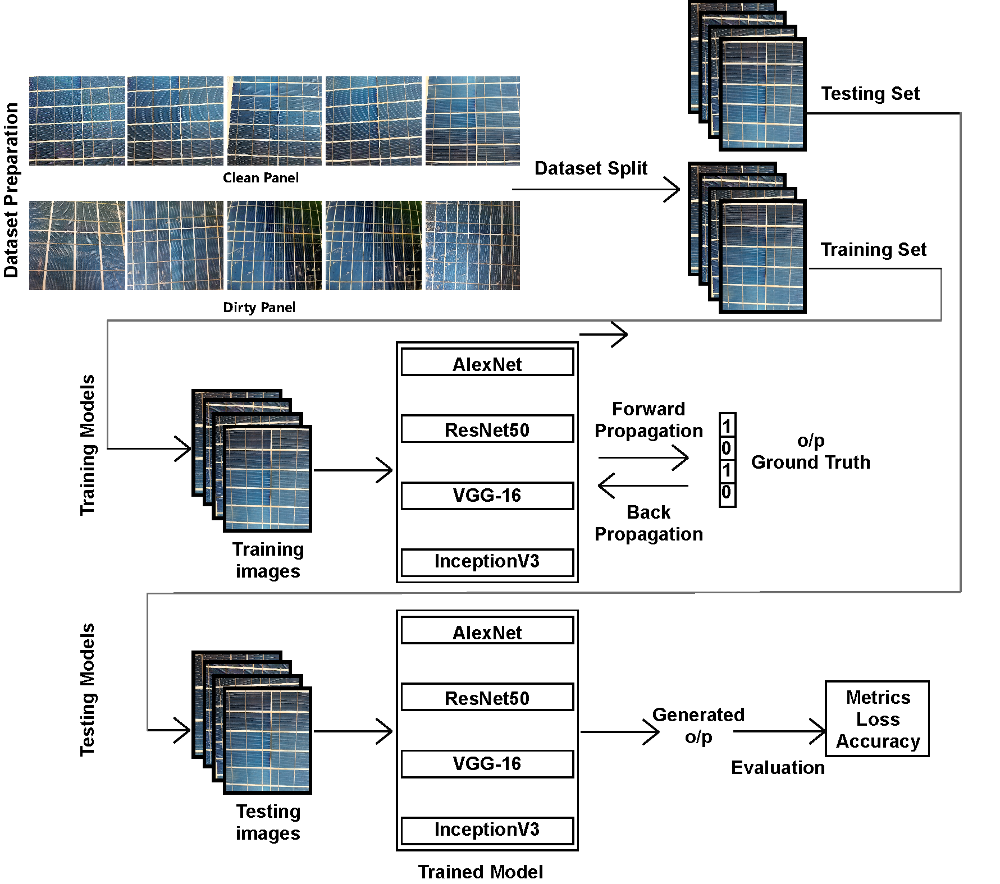
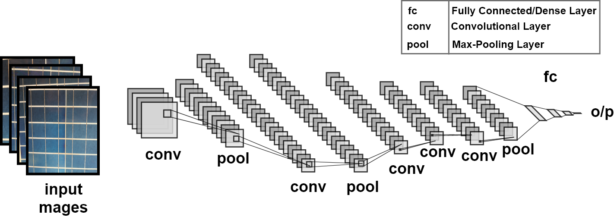

# SolNET
```
Implementation of the paper "SolNet: A Convolutional Neural Network for Detecting Dust on Solar Panels"
Authors:
	Md. Saif Hassan Onim,
	Zubayar Mahatab Md Sakif,
	Adil Ahnaf,
	Ahsan Kabir,
	Rafina Afreen,
	Sumaita Tanjim Hridy,
	Mahtab Hossain,
	Abul Kalam Azad,
	Taskeed Jabid and
	Md Sawkat Ali
```

<p align="center"></p>
<em align="center"> Workflow </em>
<p align="center"></p>
<em align="center"> SolNet Architecture </em>

## Experimental Steps
- Get the dataset from here: [Dataset](https://drive.google.com/drive/folders/12Q3MBI8SPw0vHsO_kkS5izkxw0F7tXx4?usp=sharing)

- Keep the dataset in the dataset folder. You can keep your own dataset for testing purpose.

- Run the 'train.py' from 'utils' folder to train the model

- Run 'evaluate.py' form 'utils' folder to generate loss and acc vs epoch graph.


## Pretrained SolNET
- Get the pretrained SolNet model from here: [Model](https://drive.google.com/drive/folders/1HNJ4fB28DLvzuSoj75qdDAQv9BLeavBs?usp=share_link)

- keep the model in 'models' folder

- Use tensorflows ```predict``` command to test in your own dataset.

## Cite us with the following bibtex:
```
@Article{SolNet2022,
AUTHOR = {Onim, Md Saif Hassan and
	Sakif, Zubayar Mahatab Md and
	Ahnaf, Adil and
	Kabir, Ahsan and
	Azad, Abul Kalam and
	Oo, Amanullah Maung Than and
	Afreen, Rafina and
	Hridy, Sumaita Tanjim and
	Hossain, Mahtab and
	Jabid, Taskeed and
	Ali, Md Sawkat},
TITLE = {SolNet: A Convolutional Neural Network for Detecting Dust on Solar Panels},
JOURNAL = {Energies},
VOLUME = {16},
YEAR = {2023},
NUMBER = {1},
ARTICLE-NUMBER = {155},
URL = {https://www.mdpi.com/1996-1073/16/1/155},
ISSN = {1996-1073},
DOI = {10.3390/en16010155}
}
```
